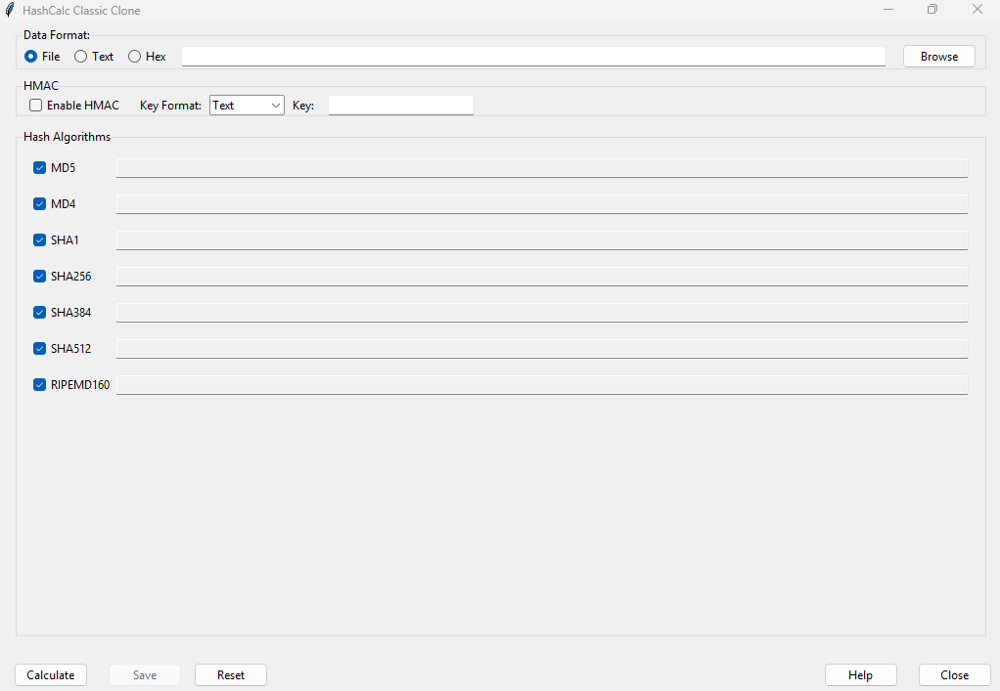

# hashcalc-clone
A Python Tkinter clone of HashCalc GUI supporting multiple hash algorithms and HMAC. This HashCalc clone includes a 'Save' feature that allows users to export hash results in PDF, TXT, or DOCX formats.
## Setup Instructions
1. **Prerequisites**: Ensure you have Python 3.x installed on your system
2. **Clone the repository**:
   ```bash
   git clone https://github.com/cyborgsri/hashcalc-clone.git
   cd hashcalc-clone
   ```
3. **Install dependencies** (if any):
   ```bash
   pip install -r requirements.txt
   ```
   Note: This project uses standard Python libraries (tkinter, hashlib), so no external dependencies are required
4. **Run the application**:
   ```bash
   python hashcalc5.py
   ```
## Usage
1. **Launch the application**: Run `python hashcalc5.py` to open the HashCalc GUI

